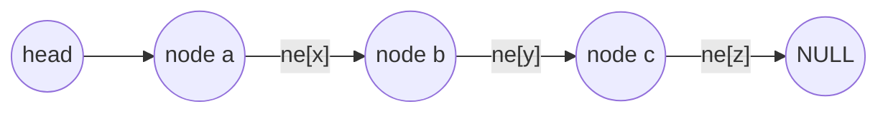
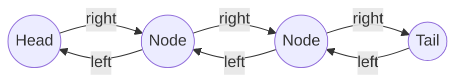
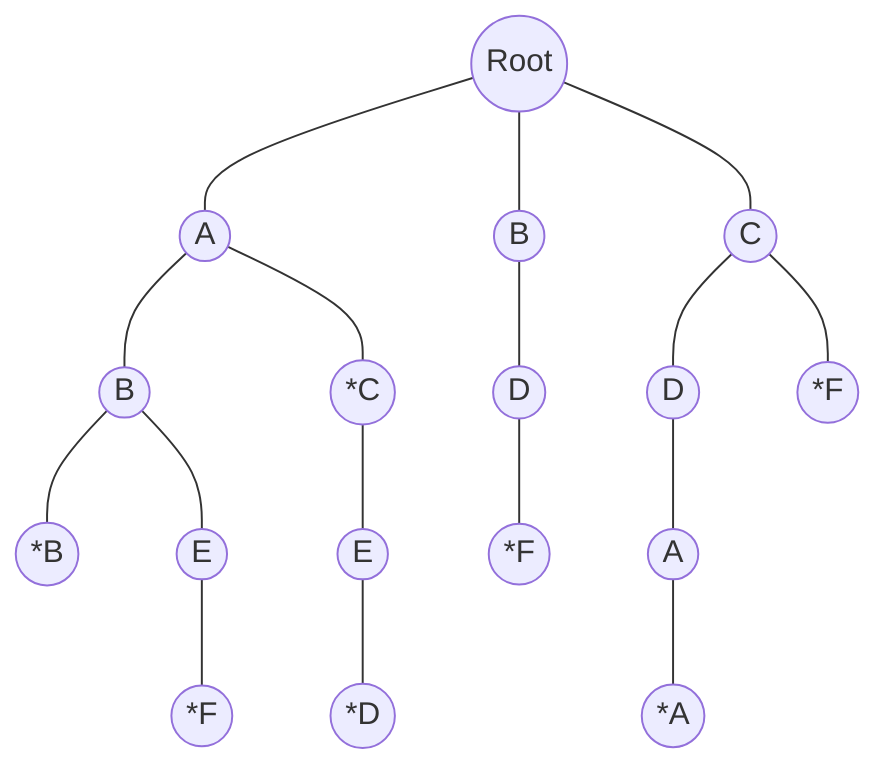
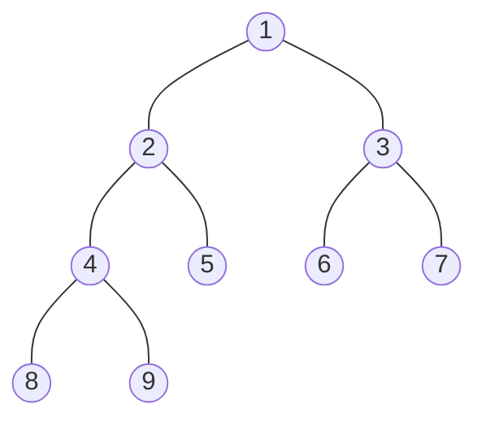
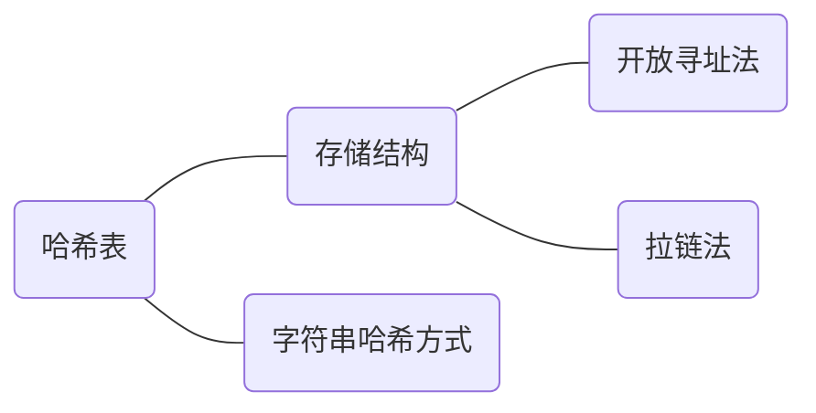

## 数据结构

### 链表与邻接表

#### 单链表

**$e[i]:$某点的值，$ne[i]:$某点的next指针**



```cpp
//head 表示头节点下标 (ne[-1])
//e[i] 表示节点 i 的值
//ne[i] 表示结点 i 的 next 指针的值 (下一结点下标)
//idx 存储当前已经用到了哪个点
int head,e[N],ne[N],idx;
//初始化
void init()
{
	head=-1;
    idx=0;
}
//将 x 插到头结点
void add_to_head(int x)
{
    e[idx]=x;
	ne[idx]=head;
    head=idx++;
}
//将 x 插到下标是 k 的点后面
void add(int k,int x)
{
    e[idx]=x;
    ne[idx]=ne[k];
    ne[k]=idx++;
}
//将下标是 k 的点后面的点删除
void remove(int k)
{
	ne[k]=ne[ne[k]];
}
```

**邻接表：存储图和数**

#### 双链表



```cpp
int e[N],l[N],r[N],idx;
void init()
{
    r[0]=1,l[1]=0;//0 表示左端点, 1 表示右端点
    idx=2;
}
void add(int k,int x)//在 k 的右边插入 x
{
	e[idx]=x;
    l[idx]=k;r[idx]=r[k];
    l[r[k]]=idx;r[k]=idx++;  
}
void del(int k)
{
	r[l[k]]=r[k];
    l[r[k]]=l[k];
}
```


### 栈与队列

1.   **栈：先进后出**
     *   **定义：`int stk[N],tt=0;`**
     *   **插入：`stk[++tt]=x;`**
     *   **弹出：`tt--;`**
     *   **判断栈是否为空：`if(tt>0)`**
     *   **栈顶：`stk[tt]`**
     
2.   **队列：先进后出**
     
     *   **初始化：`int q[N],hh=0,tt=-1;`**
     *   **插入：`q[++tt]=x;`**
     *   **弹出：`hh++;`**
     *   **判断是否为空：`if(hh<=tt)`**
     *   **取出队头：`q[hh]`**

#### 单调栈与队列

1.   **单调栈**

     应用：给定序列，求每个数左边最近的比它大/小的数

     ```cpp
     for(int i=0;i<n;i++)//生成单调增的栈
     {//tt 为栈顶
         cin>>x;
         while(tt&&stk[tt]>=x) tt--;//出栈 从栈顶弹出
         stk[++tt]=x;//入栈
     }
     ```

2.   **单调队列**

     应用：求滑动窗口最大值最小值

     ```cpp
     for(int i=0;i<n;i++)//生成单调增的队列
     {//hh,tt 为队头队尾 ;k 为窗口长度
     	while(hh<=tt&&i-k+1>q[hh]) hh++;//从队头出队
         while(hh<=tt&&a[q[tt]]>=a[i]) t--;//从队尾出队
         q[++tt]=i;//从队尾入队
     }
     ```


### KMP

**基本思想：利用已匹配过的信息来跳过重复的比较，复杂度从$O(n*m)$降到$O(n+m)$**

**前缀函数：$\pi_i$ 表示 第$i$个前缀的最长匹配真前后缀的长度**

**朴素算法**

```cpp
for(int i=1;i<=n;i++)
{
	bool flag=true;
    for(int j=1;j<=m;j++)
		if(s[i+j]!=p[j])
        {
            flag=false;
        	break;
        }
}
```

#### KMP算法

```cpp
// s[]是长文本，p[]是模式串，n是s的长度，m是p的长度
//要从 s+1,p+1 开始读
//求模式串的 Next 数组：
for (int i = 2, j = 0; i <= m; i ++ )
{
    while (j && p[i] != p[j + 1]) j = ne[j];
    if (p[i] == p[j + 1]) j ++ ;
    ne[i] = j;
}
//匹配字符串
for (int i = 1, j = 0; i <= n; i ++ )
{
    while (j && s[i] != p[j + 1]) j = ne[j];
    if (s[i] == p[j + 1]) j ++ ;
    if (j == m)
    {
        j = ne[j];
        // 匹配成功后的逻辑
    }
}
```


### Trie字典树



**高效地存储和查找字符串集合**

**带星号标记表示一个字符串的结束**

**`son[i][j]`表示第`i`个节点的第`j`个子节点，`cnt[N]`记录字符串插入次数，`idx`给节点编号（节点标识）**

```cpp
int son[N][26],cnt[N],idx;//下标为 0 的点既是根节点又是空节点
void insert(char str[])
{
	int p=0;//根节点
    for(int i=0;str[i];i++)
    {
        int u=str[i]-'a';//映射
        if(!son[p][u]) son[p][u]=++idx;//创建新节点
		p=son[p][u];//移动到子节点
    }
    cnt[p]++;//以该节点为结尾的字符串插入次数
}
int query(char str[])
{
	int p=0;
    for(int i=0;str[i];i++)
    {
        int u=str[i]-'a';
        if(!son[p][u]) return 0;//字符串未出现在字典树中
        p=son[p][u];
    }
    return cnt[p];//返回出现次数
}
```


### 并查集

**快速处理以下问题，复杂度近乎$O(1)$：**

1.   **将两个集合合并**
2.   **询问两个元素是否在一个集合当中**

**基本原理：每个集合用一棵树来表示，树根的编号就是整个集合的编号，每个节点存储它的父节点，`p[x]`表示`x`的父节点**

1.   **判断树根：`if(p[x]==x)`**
2.   **求`x`的集合编号：`while(p[x]!=x) x=p[x];`**
3.   **合并集合：`p[x]=y`（集合`x`插入到集合`y`）**

**路径压缩：将查找时沿途经过的所有节点直接连接到根节点，优化查找操作时间**

**按秩合并：合并时，将“秩”较小的数合并到“秩”较大的树下，优化合并操作时间**

#### 朴素并查集

```cpp
int p[N]; //存储每个点的祖宗节点
// 返回x的祖宗节点 +  路径压缩
int find(int x)
{
    if (p[x] != x) p[x] = find(p[x]);
    return p[x];
}
// 初始化，假定节点编号是1~n
for (int i = 1; i <= n; i ++ ) p[i] = i;
// 合并a和b所在的两个集合：
	p[find(a)] = find(b);
```

#### 维护Size的并查集

```cpp
int p[N], size[N];
//p[]存储每个点的祖宗节点, size[]只有祖宗节点的有意义，表示祖宗节点所在集合中的点的数量
// 返回x的祖宗节点
int find(int x)
{
    if (p[x] != x) p[x] = find(p[x]);
    return p[x];
}
// 初始化，假定节点编号是1~n
for (int i = 1; i <= n; i ++ )
{
    p[i] = i;
    size[i] = 1;
}
// 合并a和b所在的两个集合：
void merge(int a,int b)
{
	size[find(b)] += size[find(a)];
	p[find(a)] = find(b);
}
```

#### 维护到祖宗节点距离的并查集

```cpp
int p[N], d[N];
//p[]存储每个点的祖宗节点, d[x]存储x到p[x]的距离
// 返回x的祖宗节点
int find(int x)
{
    if (p[x] != x)
    {
        int u = find(p[x]);
        d[x] += d[p[x]];
        p[x] = u;
    }
    return p[x];
}
// 初始化，假定节点编号是1~n
for (int i = 1; i <= n; i ++ )
{
    p[i] = i;
    d[i] = 0;
}
// 合并a和b所在的两个集合：
p[find(a)] = find(b);
d[find(a)] = distance; // 根据具体问题，初始化find(a)的偏移量
```


### 堆

**一种特殊的完全二叉树结构，除最后一层外每一层都被填满，最后一层从左到右依次排列**

**数组存储时，$x$的左儿子是$2x$，右儿子是$2x+1$，下标从 $1$ 开始（$0$ 的左儿子还是 $0$），$dowu(x)$ 和 $up(x)$ 复杂度均为 $O(logn)$** 

**小根堆：父节点的值都小于等于其子节点的值，大根堆：父节点的值都大于等于其子节点的值** 



1.   **插入一个数：`heap[++size]=x;up(size);`**
2.   **求集合中的最小值：`heap[1]`**
3.   **删除最小值：`heap[1]=heap[size--];down(1);`**
4.   **删除任意元素（STL不能）：`heap[k]=heap[size--];down(k);up(k);`**
5.   **修改任意元素（STL不能）：`heap[k]=x;down(k);up(k);`**

```cpp
// h[N]存储堆中的值, h[1]是堆顶，x的左儿子是 2x, 右儿子是 2x+1
// ph[k]存储第 k 个插入的点在堆中的位置
// hp[k]存储堆中下标是 k 的点是第几个插入的
int h[N], ph[N], hp[N], siz;
// 交换两个点，及其映射关系
void heap_swap(int a, int b)
{
    swap(ph[hp[a]],ph[hp[b]]);
    swap(hp[a], hp[b]);
    swap(h[a], h[b]);
}
void down(int u)
{
    int t = u;
    if (u*2<=siz && h[u*2]<h[t]) t=u*2;
    if (u*2+1<=siz && h[u*2+1]<h[t]) t=u*2+1;
    if (u != t)
    {
        heap_swap(u, t);
        down(t);
    }
}
void up(int u)
{
    while (u / 2 && h[u] < h[u / 2])
    {
        heap_swap(u, u / 2);
        u >>= 1;
    }
}
// O(n)建堆
for (int i = n / 2; i; i -- ) down(i);
```


### 哈希表

**哈希表（Hash Table）是一种基于哈希函数实现的快速查找数据结构。通过哈希函数将复杂数据结构映射，实现快速查找和插入**

**哈希冲突：多个不同元素通过哈希函数计算映射到哈希表中同一个槽**



#### 拉链法

**$h[N]$是哈希表，存储哈希表的索引链表头，即链表头指针**

```cpp
int h[N], e[N], ne[N], idx;
memset(h,-1,sizeof(h)); 
void insert(int x)// 向哈希表中插入一个数
{
    int k = (x % N + N) % N;//哈希函数 让余数变成正数
    e[idx] = x;
    ne[idx] = h[k];
    h[k] = idx ++ ;//第一个节点的下标
}
bool find(int x)// 在哈希表中查询某个数是否存在
{
    int k = (x % N + N) % N;
    for (int i = h[k]; i != -1; i = ne[i])
        if (e[i] == x)
            return true;
    return false;
}
```

#### 开放寻址法

**所有元素直接存储在哈希表的数组中。当发生冲突时，探测下一个槽（通过线性探测、二次探测或双重哈希等方法）直到找到空槽**

```cpp
const int N = 200003,null = 0x3f3f3f;
int h[N];//一般开数据的两到三倍 
memset(h,0x3f,sizeof h);
// 如果x在哈希表中，返回x的下标；如果x不在哈希表中，返回x应该插入的位置
int find(int x)
{
    int t = (x % N + N) % N;
    while (h[t] != null && h[t] != x)
    {
        t ++ ;
        if (t == N) t = 0;
    }
    return t;
}
int k=find[x];
h[k]=x;//插入元素
if(h[k]!=null) puts("Yes");//查找元素
```

#### 字符串哈希方式

**字符串前缀哈希法：**

$H(S[1, i]) = (s_1 \cdot b^{i-1} + s_2 \cdot b^{i-2} + \cdots + s_i \cdot b^0) \mod p$

**$s_i$ 是字符串第 $i$ 个字符的数值，$b$ 是大于字符集大小的基数，$p$ 是大质数防止哈希值过大**

经验值：$p=131$ 或 $13331$，$Q=2^{64}$（可用`unsigned long long`存储）

**递推计算前缀哈希值 ：**

$H(S[1, i]) = (H(S[1, i-1]) \cdot b + s_i) \mod p$

**字符串 $S$ 的子串 $S[l, r]$ 的哈希值：**

$H(S[l, r]) = (H(S[1, r]) - H(S[1, l-1]) \cdot b^{r-l+1}) \mod p$

```cpp
typedef unsigned long long ULL;//用 ULL 存储自动 mod 2^64
const int N = 100010,P=131;
ULL h[N], p[N]; // h[k]存储字符串前k个字母的哈希值, p[k]存储 P^k mod 2^64
p[0] = 1;
for (int i = 1; i <= n; i ++ )
{
    h[i] = h[i - 1] * P + str[i];
    p[i] = p[i - 1] * P;
}

// 计算子串 str[l ~ r] 的哈希值
ULL get(int l, int r)
{
    return h[r] - h[l - 1] * p[r - l + 1];
}
```

