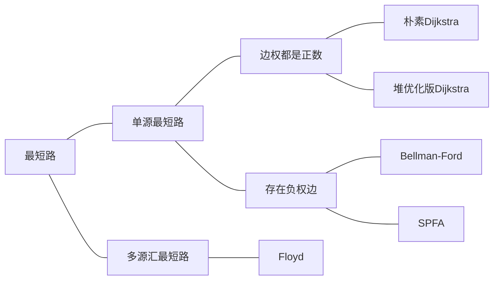
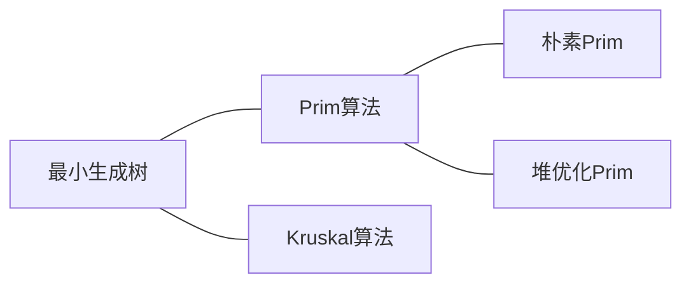
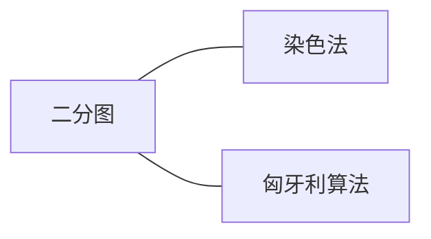

# 搜索与图论

## 树与图的存储

### 邻接表

```cpp
struct edge{
    int from,to,w;
    edge(int a,int b,int c){from=a;to=b;w=c;}
};
vector<edge> e[N];
// 初始化
for(int i=1;i<=n;i++) e[i].clear();
// 存边
e[a].push_back(edge(a,b,c));
// 遍历节点 u 的所有邻居
for(int i=0;i<e[u].size();i++) // or
for(int v:e[u]){
    int v=e[u][i].to,w=e[u][i].w;
    ...
}
```

### 邻接矩阵

```cpp
int graph[N][N];
```

### 链式前向星

```cpp
int head[N],cnt;
struct{
    int from,to,next; // from为边的起点u; to为边的终点v; next为u的下一个邻居
    int w;
}edge[M]; // 表示边
void init(){
    for(int i=0;i<N;i++) head[i]=-1; // 点初始化
    for(int i=0;i<M;i++) edge[i].next=-1; // 边初始化
    cnt=0;
}
void addedge(int u,int v,int w){
    cnt++;
    edge[cnt].from=u;
    edge[cnt].to=v;
    edge[cnt].w=w;
    edge[cnt].next=head[u]; // head[u] 指向前一条边
    head[u]=cnt; // 更新 head[u], 现在指向这一条边, 然后 cnt 自增
}
// 遍历 节点 u 的所有邻居
for(int i=head[u];~i;i=edge[i].next)
    cout<<edge[i].to;
```


## 广度优先搜索$BFS$

### 概念

**广度优先搜索（Breadth-First Search）**是一种图遍历算法，用于在图或树中按层次逐层访问节点。它从源节点（起始节点）开始，首先访问源节点的所有直接邻接节点，然后依次访问距离源节点较远的节点，直到遍历完整个图或到达目标节点

BFS通过队列逐层扩展的方式，确保按最短路径访问节点，并且保证在无权图中找到从源节点到目标节点的最短路径，适用于寻找最短路径、连通分量和解决图的层次遍历等问题

时间复杂度：$O(V+E)$，其中$V$是图中节点数（顶点数），$E$是图中的边数


### 实现方法

$BFS$ 采用 **队列（Queue）** 来保证节点的逐层访问。每当一个节点被访问时，其所有未访问的邻接节点都会被加入队列，确保接下来的节点按照它们的距离起始节点的层数顺序依次访问

```cpp
//伪代码
BFS(graph, start):
    将起始节点 start 加入队列 queue 并标记为已访问
    while queue 非空:
        当前节点 node = 从队列中弹出
        访问节点 node
        遍历 node 的所有邻接节点 neighbor:
            if neighbor 没有被访问过:
                标记 neighbor 为已访问
                将 neighbor 加入队列
```

```cpp
//C++代码（邻接表，维护了距离数组和前驱节点数组）
//Q 队列，用于存储待访问的节点
//vis 访问标记数组，记录每个节点是否被访问过
//d 距离数组，记录每个节点从起始节点的最短距离
//p 前驱节点数组，记录每个节点的前驱节点，帮助恢复路径
//head[u] 节点u的邻接表的头节点
//e[i].to 边i的目标节点
//e[i].nxt 边i的下一个边的指针，用于遍历邻接表
void bfs(int u) {
    while (!Q.empty()) Q.pop();//清空队列
    Q.push(u);
    vis[u] = 1;
    d[u] = 0;
    p[u] = -1;
    while (!Q.empty()) {
        u = Q.front();
        Q.pop();
        for (int i = head[u]; i; i = e[i].nxt) {
            if (!vis[e[i].to]) {
                Q.push(e[i].to);
                vis[e[i].to] = 1;
                d[e[i].to] = d[u] + 1;
                p[e[i].to] = u;
            }
        }
    }
}
void restore(int x) {
    vector<int> res;
    for (int v = x; v != -1; v = p[v]) res.push_back(v);
    reverse(res.begin(), res.end());
    for (int i = 0; i < res.size(); ++i) printf("%d ", res[i]);
}
```


## 深度优先搜索$DFS$

### 概念

**深度优先搜索（Depth-First Search）**是一种用于图或树的遍历算法，它的基本思想是：从一个起始节点出发，沿着一条路径一直向下遍历，直到不能继续为止，然后回溯到上一个节点，继续探索其它未被访问的节点，直到所有节点都被访问过为止

DFS的核心思想是尽量深入每一个分支，探索到没有可再走的路径后，再回退到上一层节点进行其他路径的搜索

时间复杂度：$O(V+E)$


### 实现方法

#### 递归

实现DFS最常见的方法，能直观的利用函数调用栈自动进行回溯。递归地访问当前节点的所有未访问的邻居；每次递归调用都会进入下一个节点，直到无法访问为止，再回溯到上一个节点，继续访问其他未被访问的邻居

```cpp
int n,path[N];
bool st[N + 1]; // 标记数组
void dfs(int u) // 排列第 u 个数
{
    if (u == n)
    {
        for (int i = 0; i < n; i++)
            printf("%5d", path[i]);
        printf("\n");
        return;
    }
    for (int i = 1; i <= n; i++)
    {
        if (!st[i])
        {
            path[u] = i;   // 将 i 放入当前排列的位置
            st[i] = true;  // 标记 i 已被使用
            dfs(u + 1);    // 递归 构造排列的下一个位置
            st[i] = false; // 回溯 撤销选择，取消对 i 的标记
        }
    }
}
```

#### 栈

显式地使用栈来模拟递归过程。从栈顶取出节点并访问，将当前节点的所有未访问的邻居压入栈中；当所有邻居被访问后，出栈，回溯到上一个节点。显式栈避免了递归带来的栈溢出问题，适合于需要较大深度遍历的场景

```cpp
vector<vector<int>> adj;  //邻接表
vector<bool> vis;         //记录节点是否已经遍历

void dfs(int s) {
    stack<int> st;
    st.push(s);
    vis[s] = true;
    while (!st.empty()) {
        int u = st.top();
        st.pop();
        for (int v : adj[u]) {
            if (!vis[v]) {
                vis[v] = true;  //确保栈里没有重复元素
                st.push(v);
            }
        }
    }
}
```


## 最短路



### 朴素$Dijkstra$算法

复杂度：$O(n^2)$，适合稠密图

**主要步骤：**

1.  初始化距离数组，源节点到源节点的距离为0，其余节点为无限大
2.  选择一个未访问的节点`u`，其最短路径估计值最小
3.  用`dist[u]`更新从节点`u`到其邻接节点的距离
4.  重复步骤2和3，直到所有节点都被访问

```cpp
int g[N][N];  // 存储每条边
int dist[N];  // 存储1号点到每个点的最短距离
bool st[N];   // 存储每个点的最短路是否已经确定
// 求1号点到n号点的最短路，如果不存在则返回-1
int dijkstra()
{
    memset(dist, 0x3f, sizeof dist);
    dist[1] = 0;
    for (int i = 0; i < n - 1; i ++ )
    {
        int t = -1;// 在还未确定最短路的点中，寻找距离最小的点
        for (int j = 1; j <= n; j ++ )
            if (!st[j] && (t == -1 || dist[t] > dist[j]))
                t = j;
        // 用t更新其他点的距离
        for (int j = 1; j <= n; j ++ )
            dist[j] = min(dist[j], dist[t] + g[t][j]);
        st[t] = true;
    }
    if (dist[n] == 0x3f3f3f3f) return -1;
    return dist[n];
}
```


### 堆优化版$Dijkstra$算法

复杂度：$O(m\log n)$，适合稀疏图

**主要步骤：**

1.  初始化：设置源节点到源节点的距离为0，其他节点为无穷大，并将源节点加入最小堆。
2.  每次从堆中弹出距离最小的节点，更新它的所有邻接节点
3.  每次更新邻接节点的距离时，将新的距离值插入堆中，保持堆的有序性
4.  重复直到所有节点的最短路径都被计算出来

```cpp
typedef pair<int, int> PII;
int n;      // 点的数量
int h[N], w[N], e[N], ne[N], idx;       // 邻接表存储所有边
int dist[N];        // 存储所有点到1号点的距离
bool st[N];     // 存储每个点的最短距离是否已确定
// 求1号点到n号点的最短距离，如果不存在，则返回-1
int dijkstra()
{
    memset(dist, 0x3f, sizeof dist);
    dist[1] = 0;
    priority_queue<PII, vector<PII>, greater<PII>> heap;
    heap.push({0, 1});      // first存储距离，second存储节点编号
    while (heap.size())
    {
        auto t = heap.top();
        heap.pop();

        int ver = t.second, dis = t.first;

        if (st[ver]) continue;
        st[ver] = true;

        for (int i = h[ver]; i != -1; i = ne[i])
        {
            int j = e[i];
            if (dist[j] > dis + w[i])
            {
                dist[j] = dis + w[i];
                heap.push({dist[j], j});
            }
        }
    }
    if (dist[n] == 0x3f3f3f3f) return -1;
    return dist[n];
}
```


#### 模板

```cpp
#include <bits/stdc++.h>
using namespace std;
const long long INF = 0x3f3f3f3f3f3f3f3fLL;
const int N = 2e5+10;
struct edge{
    int from,to;
    long long w;
    edge(int a,int b,long long c){from=a;to=b;w=c;}
};
vector<edge> e[N];
struct node{
    int id;long long n_dis;
    node(int b,long long c){id=b;n_dis=c;}
    bool operator<(const node&a) const{return n_dis>a.n_dis;}
};
int n,m;
int pre[N];
void print_path(int s,int t){
    if(s==t){printf("%d",s);return;}
    print_path(s,pre[t]);
    printf("%d",t);
}
long long dis[N];
bool done[N];
void dijkstra(int s){
    for(int i=1;i<=n;i++){dis[i]=INF;done[i]=false;}
    dis[s]=0;
    priority_queue<node> Q;
    Q.push(node(s,dis[s]));
    while(!Q.empty()){
        node u=Q.top();
        Q.pop();
        if(done[u.id]) continue;
        done[u.id]=true;
        for(int i=0;i<e[u.id].size();i++){
            edge y=e[u.id][i];
            if(done[y.to]) continue;
            if(dis[y.to]>y.w+u.n_dis){
                dis[y.to]=y.w+u.n_dis;
                Q.push(node(y.to,dis[y.to]));
                pre[y.to]=u.id;
            }
        }
    }
    // print_path(s,n);
}
int main(){
    scanf("%d%d",&n,&m);
    for(int i=1;i<=n;i++) e[i].clear();
    while(m--){
        int u,v,w;  scanf("%d%d%lld",&u,&v,&w);
        e[u].push_back(edge(u,v,w));
        // e[v].push_back(edge(v,u,w));
    }
    dijkstra(1);
    for(int i=1;i<=n;i++){
        if(dis[i]>=INF) cout<<"-1 ";
        else printf("%lld ",dis[i]);
    }
}
```


### $Bellman-Ford$ 算法

$O(nm)$

**主要步骤：**

通过**松弛操作**逐步更新每个节点到源节点的最短路径

1.  **初始化**：将源节点到自身的距离设置为0，其他所有节点的距离设置为无穷大。
2.  **松弛操作**：对于每一条边`(u, v)`，如果`dist[u] + weight(u, v) < dist[v]`，则更新`dist[v] = dist[u] + weight(u, v)`。松弛操作会对所有的边进行`V - 1`次
3.  **停止条件**：松弛操作重复`V - 1`次后，所有节点的最短路径就会确定

```cpp
int n, m;       // n表示点数，m表示边数
int dist[N];        // dist[x]存储1到x的最短路距离
struct Edge     // 边，a表示出点，b表示入点，w表示边的权重
{
    int a, b, w;
}edges[M];
// 求1到n的最短路距离，如果无法从1走到n，则返回-1。
int bellman_ford()
{
    memset(dist, 0x3f, sizeof dist);
    dist[1] = 0;
    // 如果第n次迭代仍然会松弛三角不等式，就说明存在一条长度是n+1的最短路径，由抽屉原理，路径中至少存在两个相同的点，说明图中存在负权回路。
    for (int i = 0; i < n; i ++ )
        for (int j = 0; j < m; j ++ )
        {
            int a = edges[j].a, b = edges[j].b, w = edges[j].w;
            if (dist[b] > dist[a] + w)
                dist[b] = dist[a] + w;//松弛操作 
        }
    if (dist[n] > 0x3f3f3f3f / 2) return -1;
    return dist[n];
}
```


### $SPFA$ 算法

$O(m) \sim O(nm)$

**主要步骤：**

1.  **初始化**：

    设置源节点的距离为0，其他节点为无穷大，并将源节点加入队列

2.  **松弛操作**：

    *   从队列中取出一个节点`u`，检查它所有的邻接边`(u, v)`，如果`dist[u] + weight(u, v) < dist[v]`，则更新`dist[v]`并将`v`加入队列。
    *   如果节点`v`已经在队列中，那么就不需要重复加入队列。

3.  **终止条件**：

    当队列为空时，算法终止

```cpp
int n;      // 总点数
int h[N], w[N], e[N], ne[N], idx;       // 邻接表存储所有边
int dist[N];        // 存储每个点到1号点的最短距离
bool st[N];     // 存储每个点是否在队列中

// 求1号点到n号点的最短路距离，如果从1号点无法走到n号点则返回-1
int spfa()
{
    memset(dist, 0x3f, sizeof dist);
    dist[1] = 0;

    queue<int> q;
    q.push(1);
    st[1] = true;

    while (q.size())
    {
        auto t = q.front();
        q.pop();
        st[t] = false;
        for (int i = h[t]; i != -1; i = ne[i])
        {
            int j = e[i];
            if (dist[j] > dist[t] + w[i])
            {
                dist[j] = dist[t] + w[i];
                if (!st[j])// 如果队列中已存在j，则不需要将j重复插入
                {
                    q.push(j);
                    st[j] = true;
                }
            }
        }
    }
    if (dist[n] == 0x3f3f3f3f) return -1;
    return dist[n];
}
```

```cpp
//SPFA判断负环
int cnt[N];// cnt[x]存储1到x的最短路中经过的点数
bool spfa()
{
    // 不需要初始化dist数组
    // 原理：如果某条最短路径上有n个点（除了自己），那么加上自己之后一共有n+1个点，由抽屉原理一定有两个点相同，所以存在环。
    queue<int> q;
    for (int i = 1; i <= n; i ++ )
    {
        q.push(i);
        st[i] = true;
    }
    while (q.size())
    {
        auto t = q.front();
        q.pop();st[t] = false;
        for (int i = h[t]; i != -1; i = ne[i])
        {
            int j = e[i];
            if (dist[j] > dist[t] + w[i])
            {
                dist[j] = dist[t] + w[i];
                cnt[j] = cnt[t] + 1;
                if (cnt[j] >= n) return true;       // 如果从1号点到x的最短路中包含至少n个点（不包括自己），则说明存在环
                if (!st[j])
                {
                    q.push(j);
                    st[j] = true;
                }
            }
        }
    }
    return false;
}
```


### $Floyd$ 算法

$O(n^3)$

不能有负权回路

$d[k,i,j]$：经过$1 \sim k$ 这些点，从 $i$ 到 $j$ 的距离

状态转移方程：$d[k,i,j]=d[k-1,i,k]+d[k-1,k,j]$

```cpp
//初始化
    for (int i = 1; i <= n; i ++ )
        for (int j = 1; j <= n; j ++ )
            if (i == j) d[i][j] = 0;
            else d[i][j] = INF;
//算法结束后，d[a][b]表示a到b的最短距离
void floyd()
{
    for (int k = 1; k <= n; k ++ )
        for (int i = 1; i <= n; i ++ )
            for (int j = 1; j <= n; j ++ )
                d[i][j] = min(d[i][j], d[i][k] + d[k][j]);
}
```


## 最小生成树




### 朴素 $Prim$

$O(n^2)$ ，适用稠密图

**步骤：**

1.   **初始化**：从任意一个节点开始，加入生成树
2.   **选择边**：每次从已加入生成树的节点集和未加入生成树的节点集之间选择一条权重最小的边，并将该边另一端节点加入生成树
3.   **停止条件**：当生成树包含所有的节点时，算法停止

```cpp
int n;      // n表示点数
int g[N][N];        // 邻接矩阵，存储所有边
int dist[N];        // 存储其他点到当前最小生成树的距离
bool st[N];     // 存储每个点是否已经在生成树中
// 如果图不连通，则返回INF(值是0x3f3f3f3f), 否则返回最小生成树的树边权重之和
int prim()
{
    memset(dist, 0x3f, sizeof dist);

    int res = 0;
    for (int i = 0; i < n; i ++ )
    {
        int t = -1;
        for (int j = 1; j <= n; j ++ )
            if (!st[j] && (t == -1 || dist[t] > dist[j]))
                t = j;

        if (i && dist[t] == INF) return INF;

        if (i) res += dist[t];
        st[t] = true;

        for (int j = 1; j <= n; j ++ ) dist[j] = min(dist[j], g[t][j]);
    }

    return res;
}
```


### $Kruskal$ 算法

$O(m \log m)$，适用稀疏图

**步骤：**

1.   **排序**：将所有的边按权重从小到大排序
2.   **选择边**：从权重最小的边开始，依次选择边，加入生成树中。如果选择的边会形成环，则跳过
3.   **合并**：使用并查集来管理图中的连通性，确保每次选择的边不会形成环
4.   **停止条件**：当选取的边数达到`V-1`（`V`是图中节点的数量）时，算法结束，得到最小生成树

```cpp
int n, m;       // n是点数，m是边数
int p[N];       // 并查集的父节点数组
struct Edge     // 存储边
{
    int a, b, w;
    bool operator< (const Edge &W)const
    	{return w < W.w;}
}edges[M];
int find(int x)     // 并查集核心操作
{
    if (p[x] != x) p[x] = find(p[x]);
    return p[x];
}
int kruskal()
{
    sort(edges, edges + m);
    for (int i = 1; i <= n; i ++ ) p[i] = i;// 初始化并查集
    int res = 0, cnt = 0;
    for (int i = 0; i < m; i ++ )
    {
        int a = edges[i].a, b = edges[i].b, w = edges[i].w;
        a = find(a), b = find(b);
        if (a != b)// 如果两个连通块不连通，则将这两个连通块合并
        {
            p[a] = b;
            res += w;
            cnt ++ ;
        }
    }
    if (cnt < n - 1) return INF;//不是连通图
    return res;
}
```


## 二分图




### 染色法

$O(n+m)$，一个图是二分图，当且仅当图中不含奇数环

```cpp
int n;      // n表示点数
int h[N], e[M], ne[M], idx;     // 邻接表存储图
int color[N];       // 表示每个点的颜色，-1表示未染色，0表示白色，1表示黑色

// 参数：u表示当前节点，c表示当前点的颜色
bool dfs(int u, int c)
{
    color[u] = c;
    for (int i = h[u]; i != -1; i = ne[i])
    {
        int j = e[i];
        if (color[j] == -1)
            if (!dfs(j, !c)) return false;
        else if (color[j] == c) return false;
    }
    return true;
}
bool check()
{
    memset(color, -1, sizeof color);
    bool flag = true;
    for (int i = 1; i <= n; i ++ )
        if (color[i] == -1)
            if (!dfs(i, 0))
            {
                flag = false;
                break;
            }
    return flag;
}
```


### 匈牙利算法

$O(mn)$，实际运行时间远小于 $O(mn)$

```cpp
int n1, n2;     // n1表示第一个集合中的点数，n2表示第二个集合中的点数
int h[N], e[M], ne[M], idx;     // 邻接表存储所有边，匈牙利算法中只会用到从第一个集合指向第二个集合的边，所以这里只用存一个方向的边
int match[N];       // 存储第二个集合中的每个点当前匹配的第一个集合中的点是哪个
bool st[N];     // 表示第二个集合中的每个点是否已经被遍历过
bool find(int x)
{
    for (int i = h[x]; i != -1; i = ne[i])
    {
        int j = e[i];
        if (!st[j])
        {
            st[j] = true;
            if (match[j] == 0 || find(match[j]))
            {
                match[j] = x;
                return true;
            }
        }
    }
    return false;
}
// 求最大匹配数，依次枚举第一个集合中的每个点能否匹配第二个集合中的点
int res = 0;
for (int i = 1; i <= n1; i ++ )
{
    memset(st, false, sizeof st);
    if (find(i)) res ++ ;
}
```


## 其他

### 双向广搜

```cpp
void bfs(string A, string B)
{
    queue<string> qa, qb;
    qa.push(A);
    qb.push(B);
    while (qa.size() && qb.size())
    {
        if (qa.size() < qb.size()) // 扩展队列长度小的
            extend(qa, ...);
        else
            extend(qb, ...);
    }
    return;
}
```

### $BFS$ + 优先队列
