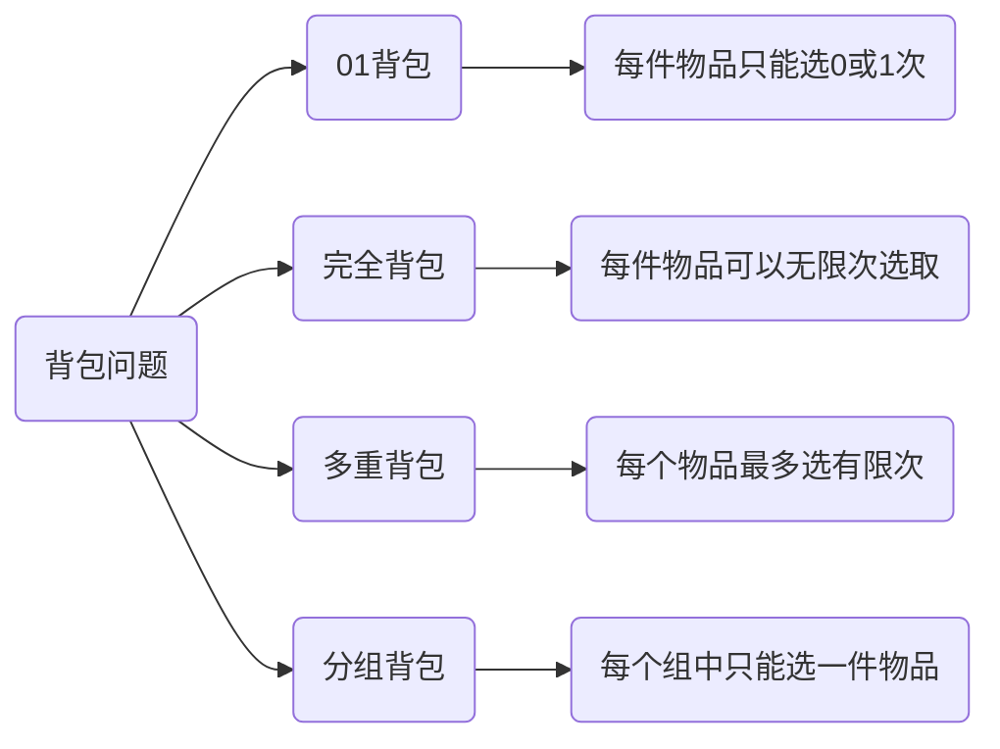
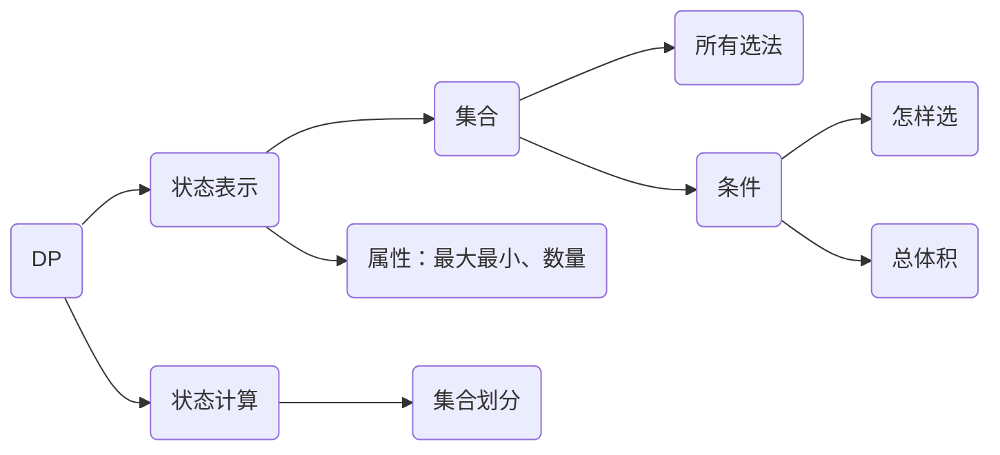

# 动态规划

**Dynamic Programming**

## 背包问题




### 思路



### 01背包

**每件物品只能选0或1次**

给定容量为 $W$ 的背包和 $n$ 件物品，每件物品都有重量 $w_i$ 和价值 $v_i$ ，每件物品只能选取 0 次或 1 次。求背包内物品的最大化价值

**状态转移方程：**

$dp[i][j]=\max (dp[i-1][j],dp[i-1][j-w_i]+v_i)$

$dp[i][j]$：从前 $i$ 个物品中选择并放入容量为 $j$ 的背包时，可以获得的最大价值

$dp[i-1][j]$：不选第 $i$ 个物品

$dp[i-1][j-w_i]+v_i$：选择第 $i$ 个物品

**滚动数组优化：**

$dp[j]=\max (dp[j-1],dp[j-v[i]]+w[i])$

```cpp
//二维
for(int i=1;i<=n;i++)
    for(int j=1;j<=m;j++)
    {
        dp[i][j]=dp[i-1][j];
        if(j>=v[i]) dp[i][j]=max(dp[i-1][j],dp[i-1][j-v[i]]+w[i]);
    }
//一维
for(int i=1;i<=n;i++)
    for(int j=m;j>=v[i];j--)//从后向前遍历避免数据覆盖
        dp[j]=max(dp[j],dp[j-v[i]]+w[i]);
```


### 完全背包

**每件物品可以无限次选取**

**状态转移方程：**

$dp[i][j]=\max (dp[i-1][j-k \cdot v[i]]+k \cdot w[i])$

**优化：**

$$\begin{array}{rl}
dp[i,j] &=&\max (dp[i-1,j],dp[i-1,j-v]+w,dp[i-1,j-2v]+2w,\dots,dp[i-1,j-kv]+kw) \\
dp[i,j-v] &=&\max (dp[i-1,j-v],dp[i-1,j-2v]+w,\dots,dp[i-1,j-kv]+(k-1)w) \\
\Longrightarrow &&dp[i,j]=\max (f[i-1,j],f[i][j-v]+w) \\
\end{array}$$

```cpp
//二维
for(int i=1;i<=n;i++)
    for(int j=1;j<=m;j++)
    {
        dp[i][j]=dp[i-1][j];
        if(j>=v[i]) dp[i][j]=max(dp[i][j],dp[i][j-v[i]]+w[i]);
    }
//一维
for(int i=1;i<=n;i++)
    for(int j=v[i];j<=m;j++)
        dp[j]=max(dp[j],dp[j-v[i]]+w[i]);//从前向后遍历，此时dp[j-v[i]]为第 i 层
```


### 多重背包

**每个物品最多选有限次**

**状态转移方程：**

$dp[i][j]=\max (dp[i-1][j-k\cdot v[i]]+k\cdot w[i])\quad(k=0,1,2,\dots,s[i])$

**优化：**

**将$S$用二进制表示**

$O(n^3)\rightarrow O(n^2\log S)$

```cpp
//二维
for(int i=1;i<=n;i++)
    for(int j=1;j<=m;j++)
    	for(int k=0;k<=s[i]&&k*v[i]<=j;k++)
            dp[i][j]=max(dp[i][j],dp[i-1][j-v[i]*k]+w[i]*k);
//一维
for(int i=1;i<=n;i++)
    for(int j=m;j>=0;j--)
    	for(int k=0;k<=s[i]&&k*v[i]<=j;k++)
            dp[j]=max(dp[j],dp[j-v[i]*k]+w[i]*k);
//优化
int cnt=0;
for(int i=1;i<=n;i++)
{
    int a,b,s;
    cin>>a>>b>>s;
    int k=1;
    while(k<=s)
    {
        cnt++;
        v[cnt]=a*k;
        w[cnt]=b*k;
        s-=k;
        k*=2;
    }
    if(s>0)
    {
        cnt++;
        v[cnt]=a*s;
        w[cnt]=b*s;
    }
}
n=cnt;
for(int i=1;i<=n;i++)//转化为 01 背包问题
    for(int j=m;j>=v[i];j--)
        dp[j]=max(dp[j],dp[j-v[i]]+w[i]);
```


### 分组背包

**每个组中最多选一件物品**

```cpp
for(int i=1;i<=n;i++)
    for(int j=m;j>=0;j--)
        for(int k=0;k<s[i];k++)
            if(v[i][k]<=j)
                dp[j]=max(dp[j],dp[j-v[i][k]]+w[i][k]);
```


## 线性DP

### 最长上升子序列（LCA）

**求最长的元素单调递增的子序列的长度**


### 最长公共子序列（LCS）


## 区间DP

